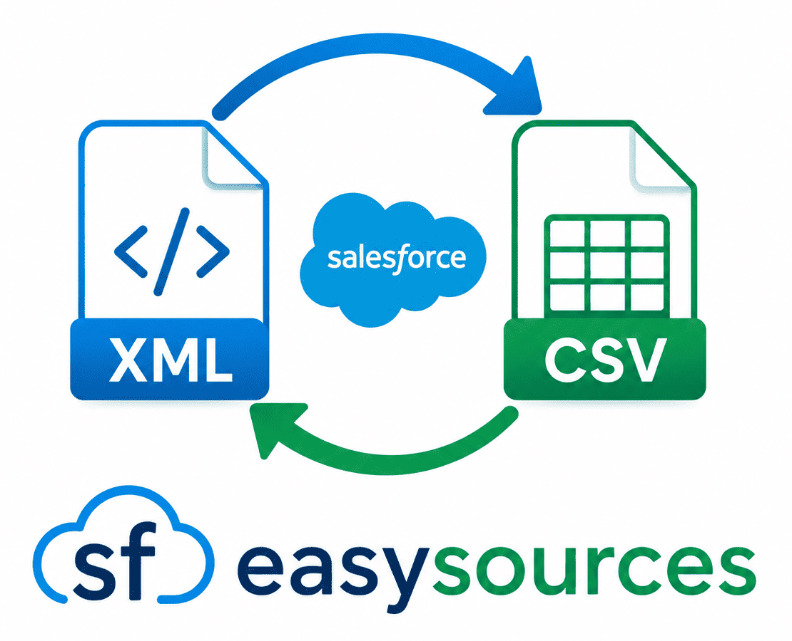

# SF EasySources - VS Code Extension

[](https://marketplace.visualstudio.com/items?itemName=raffo93p.sfvsc-easysources)
[](https://marketplace.visualstudio.com/items?itemName=raffo93p.sfvsc-easysources)
[](https://marketplace.visualstudio.com/items?itemName=raffo93p.sfvsc-easysources)

<p align="center"></p>

A powerful Visual Studio Code extension that provides a graphical user interface for the [sfdx-easy-sources](https://www.npmjs.com/package/sfdx-easy-sources) plugin. Simplify the management of Salesforce metadata sources with an intuitive interface, eliminating the need to remember complex command-line parameters.

## 🚀 What is SF EasySources?

This VS Code extension acts as a visual frontend for the `sfdx-easy-sources` CLI plugin, allowing you to:

- **Split** long XML metadata files into manageable CSV files
- **Merge** CSV files back into XML format for deployment
- **Upsert** new entries into existing CSV files after retrievals
- **Delete** specific permissions across multiple profiles or permission sets
- **Minify** metadata by removing unnecessary entries
- **Clean** references that don't exist in your org or repository
- **Validate** alignment between XML and CSV representations
- **Custom Upsert** specific entries using JSON content

All through an easy-to-use graphical interface directly in VS Code!

## ✨ Features

### Intuitive Visual Interface
- **No more command-line memorization**: Select metadata type, action, and parameters through an interactive form
- **Real-time command preview**: See the generated command before execution
- **Smart field validation**: Only show relevant options based on your selections
- **Execution results**: View command output and execution details directly in the panel

### Supported Metadata Types
- **Profiles** - Full support for all operations
- **Permission Sets** - Complete permission management
- **Record Types** - Object-specific record type handling
- **Custom Labels** - Label management and translation
- **Global Value Sets** - Picklist value set operations
- **Applications** - App configuration management
- **Object Translations** - Field and object translation handling
- **Translations** - Multi-language support files
- **All Metadata** - Bulk operations across multiple types

### Available Actions
Each metadata type supports various actions (depending on the type):
- **Split**: Convert XML to CSV format
- **Merge**: Convert CSV back to XML
- **Upsert**: Add/update entries in existing CSV files
- **Custom Upsert**: Insert/update specific entries using JSON
- **Delete**: Remove specific permissions or references
- **Minify**: Clean up unnecessary entries
- **Clean**: Remove non-existent references
- **Clear Empty**: Remove empty CSV files and folders
- **Are Aligned**: Validate XML/CSV synchronization
- **Update Key**: Refresh the `_tagid` column

### Key Capabilities

#### Selective Execution
- Choose specific profiles, permission sets, or other metadata items
- Filter by object for record types
- Select individual record types when needed

#### Action-Specific Features

**Delete Action**:
- Remove specific class access, page access, field permissions, etc.
- Bulk deletion across all selected metadata items
- Type-safe field selection

**Custom Upsert Action**:
- JSON-based content insertion
- Automatic key calculation
- Support for single or multiple entries
- Smart field handling (ignores non-existent keys, handles omitted fields)

**Are Aligned Action**:
- String mode: Exact character-by-character comparison
- Logic mode: Data structure comparison
- Detailed validation reports

#### Developer Features
- **Command preview**: See the exact CLI command that will be executed
- **Execution results**: Detailed output with success/error information
- **Inline help**: Contextual descriptions for each action

## 📋 Requirements

- **VS Code**: Version 1.86.0 or higher
- **Node.js**: Version 18.x or higher
- **sfdx-easy-sources**: Automatically installed as a dependency (v1.0.1+)
- **Salesforce CLI**: Required for Salesforce operations
- **easysources-settings.json**: Configuration file in your workspace (created via `sf easysources settings init`)

## 🛠️ Installation

1. Install the extension from the VS Code Marketplace
2. Ensure you have Salesforce CLI installed
3. Initialize your project settings:
   ```bash
   sf easysources settings init
   ```
4. Open the command palette (`Cmd+Shift+P` on macOS, `Ctrl+Shift+P` on Windows/Linux)
5. Search for "SF EasySources: Show Panel"

## 📖 Usage

### Basic Workflow

1. **Open the Panel**
   - Command Palette → "SF EasySources: Show Panel"
   - Or use the command: `sfvsc-easysources.showPanel`

2. **Select Metadata Type**
   - Choose from profiles, permissionsets, labels, etc.

3. **Choose Action**
   - Select the operation you want to perform (split, merge, upsert, etc.)
   - A helpful description appears for each action

4. **Configure Options** (if needed)
   - Select specific metadata items (profiles, permission sets, etc.)
   - For record types: select object and specific record types
   - For delete: specify what to delete (class, field, object, etc.)
   - For custom upsert: provide JSON content
   - For are aligned: choose validation mode

5. **Preview & Execute**
   - Review the generated command in the preview section
   - Click "Execute Command" to run
   - View results in the execution results panel

### Example: Split All Profiles

1. Open SF EasySources panel
2. Metadata: `profiles`
3. Action: `split`
4. Click "Execute Command"

### Example: Delete a Field Permission from Specific Profiles

1. Metadata: `profiles`
2. Action: `delete`
3. Enable "Select profiles" checkbox
4. Select the profiles (e.g., "Admin", "Standard User")
5. Delete Type: `Field Permission`
6. Field Name: `Account.CustomField__c`
7. Click "Execute Command"

### Example: Custom Upsert Class Access

1. Metadata: `profiles`
2. Action: `customupsert`
3. Select profiles (optional, or leave empty for all)
4. Upsert Type: `classAccesses`
5. JSON Content: `{"apexClass":"MyClass","enabled":true}`
6. Click "Execute Command"

### Example: Validate Profile Alignment

1. Metadata: `profiles`
2. Action: `arealigned`
3. Mode: `string` (for exact comparison) or `logic` (for data comparison)
4. Click "Execute Command"

## ⚙️ Extension Settings

This extension relies on the `easysources-settings.json` file in your workspace. Create it using:

```bash
sf easysources settings init
```

The settings file typically contains:
```json
{
  "salesforce-xml-path": "./force-app/main/default",
  "easysources-csv-path": "./force-app/main/csv",
  "easysources-log-path": "./easysources/log"
}
```

## 🐛 Known Issues

- The extension requires `easysources-settings.json` to be present in the workspace
- Large metadata operations may take time; be patient during execution
- First-time initialization requires running the CLI command to create settings

## 📝 Release Notes

For detailed information about all releases, new features, bug fixes, and changes, please see the [**Release Notes**](./RELEASE_NOTES.md).

## 🔗 Related Resources

- **sfdx-easy-sources Plugin**: [NPM Package](https://www.npmjs.com/package/sfdx-easy-sources) | [GitHub](https://github.com/raffo93p/sfdx-easy-sources)
- **Plugin Documentation**: [Complete README](https://github.com/raffo93p/sfdx-easy-sources/blob/main/README.md) - Full documentation about the underlying plugin
- **VS Code Extension Guidelines**: [Extension Guidelines](https://code.visualstudio.com/api/references/extension-guidelines)

## 🤝 Contributing

Contributions are welcome! Please feel free to submit issues or pull requests.

## 📄 License

See the [LICENSE](LICENSE) file for details.

## 💡 Tips

- The **command preview** shows you exactly what CLI command will run
- Enable "Select [metadata]" only when you need to target specific items
- For bulk operations, leave metadata selection unchecked to process all items
- Use **minify** after split to reduce repository size
- Always **merge** before deployment to update XML files from CSV changes

---

**Enjoy simplified Salesforce metadata management with SF EasySources!** 🎉
